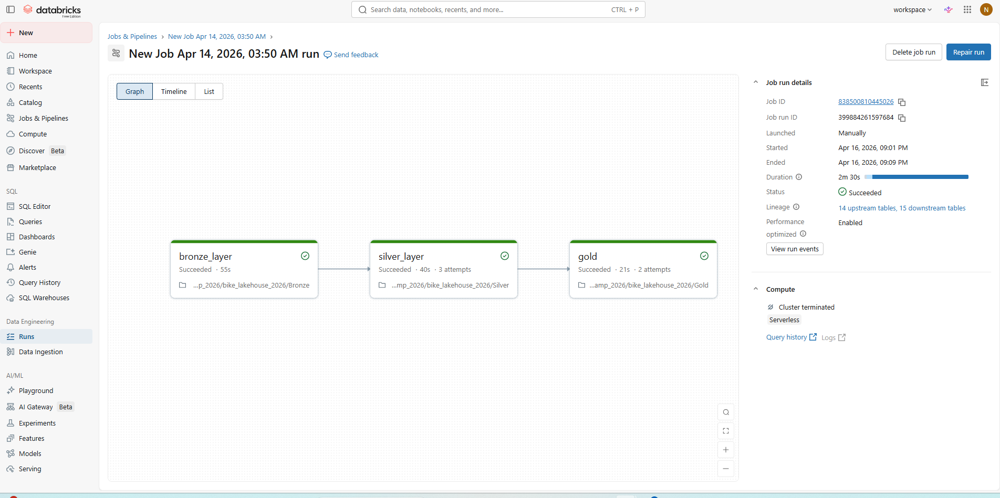
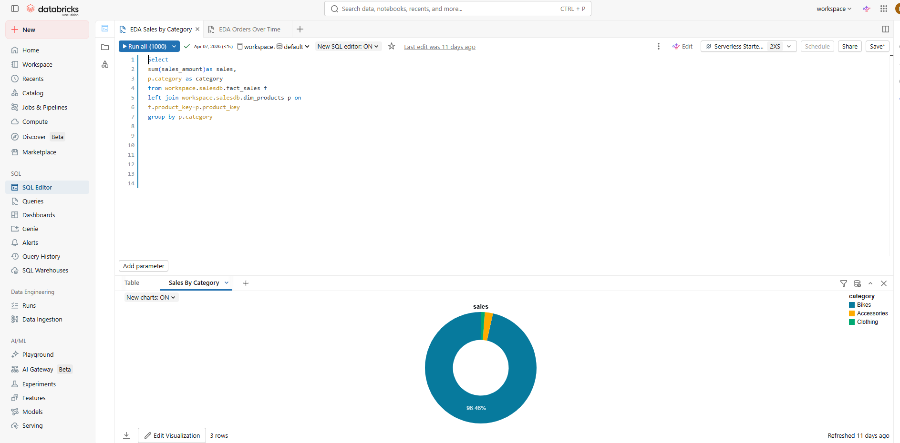

# 🚀 End-to-End Data Pipeline & Analysis using Databricks (Medallion Architecture)

---

## 📌 Overview

This project demonstrates an end-to-end data engineering pipeline using the Medallion Architecture (Bronze, Silver, Gold).

It processes sample CRM and ERP datasets (30–40 rows) and transforms raw data into a structured analytics-ready model.

The same dataset was also used in a SQL Data Warehouse project to compare traditional vs modern data engineering approaches.

---

## 🏗️ Architecture

Bronze → Silver → Gold

### Bronze Layer
- Raw data ingestion from CSV files into Delta tables

### Silver Layer
- Data cleaning and standardization
- Business rule transformations

### Gold Layer
- Star schema modeling
- Fact and dimension tables

### 📊 Analytics & Databricks SQL
After building the Gold layer, I used **Databricks SQL** to query the analytics-ready tables for reporting and insights.

- Created summary queries for sales, customers, and products  
- Validated transformations from Bronze → Silver → Gold  
- Generated metrics for dashboards and business analysis  

---

## 🛠️ Tech Stack

- Databricks  
- PySpark  
- Delta Lake  
- SQL  
- Medallion Architecture  
- Star Schema Modeling  

---

## ⚙️ Pipeline Flow

### Bronze Layer
- Loaded CRM and ERP CSV datasets  
- Stored as Delta tables  

### Silver Layer
- Removed nulls and duplicates  
- Standardized values (gender, country, product types)  
- Applied business rules  

### Gold Layer
- Created star schema model  
- Built:
  - dim_customers  
  - dim_products  
  - fact_sales  

---

## 📊 Orchestration

The pipeline is automated using Databricks Jobs:

- Bronze ingestion  
- Silver transformation  
- Gold modeling  

All tasks run sequentially in a single workflow.

---

## 📸 Pipeline Execution



---

## 📊 Data Analysis (SQL + Visualization)

---

### 📈 Sales Trend Analysis

**Objective:** Analyze monthly sales trends to understand revenue growth over time.

```sql
SELECT 
  date_trunc('month', order_date) AS orderdate,
  SUM(sales_amount) AS total_sales
FROM workspace.salesdb.fact_sales
GROUP BY date_trunc('month', order_date)
ORDER BY orderdate;
```
## 📊 Visualization
### Sales Trend Analysis


 ## 🔍 Insights 
- Sales show a consistent upward trend over time
- Revenue increases in later months indicating business growth
- Minor fluctuations suggest seasonal variation in demand
🛍️ Sales by Product Category
🎯 Objective
---
Identify which product categories contribute the most revenue.

### 🧾 SQL Query
```sql
SELECT 
  SUM(f.sales_amount) AS sales,
  p.category AS category
FROM workspace.salesdb.fact_sales f
LEFT JOIN workspace.salesdb.dim_products p 
  ON f.product_key = p.product_key
GROUP BY p.category
ORDER BY sales DESC;
```
## 📊 Visualization
### Product Category Analysis


 ## 🔍 Insights 
- Certain product categories generate the highest revenue
- Helps identify high-performing business segments
- Useful for inventory planning and marketing strategy
📌 Additional Analysis Performed
- Top customers by sales
- Revenue distribution across dimensions
- Aggregated datasets for dashboards
 ## 📚 Learning Outcome
Built end-to-end ETL pipeline using Medallion Architecture
- Learned PySpark transformations and Delta Lake
- Implemented data cleaning and standardization
- Designed star schema model for analytics
- Understood lakehouse vs traditional warehouse approach
  
 ## 🔥 Key Insight

Same dataset used in SQL Data Warehouse project helped compare:

- Traditional SQL warehouse approach
- Modern Databricks Medallion architecture

# 🚀 Result

Raw Data → Bronze → Silver → Gold → Analytics-ready Data Model
